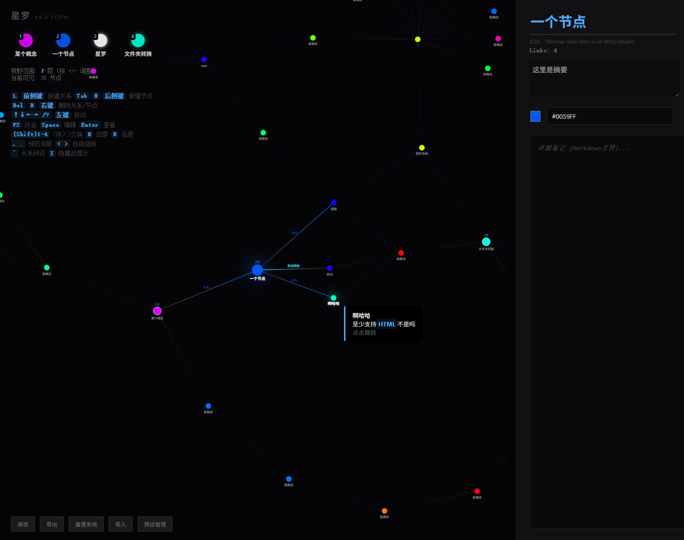

# 星罗 (Stars) - Knowledge Graph for VSCode & Web

> 本项目使用 AI 辅助生成

Stars 是一款键盘优先、沉浸式、可视化的知识探索与构建环境。它将复杂的概念体系呈现为一个可自由遨游的二维图谱。Stars 不仅作为 **VS Code 扩展** 集成在你的开发工作流中，还提供一个 **独立的 Web 版本**，旨在为用户提供极致的思维连贯性、深度的学习体验以及对知识结构更精细的掌控。

## ✨ 核心特性

-   **多平台可用**：
    *   **VS Code 扩展**：深度集成于 VS Code 环境，利用工作区根目录进行数据持久化，与你的项目文件紧密关联。
    *   **独立 Web 版本**：可在任何现代浏览器中访问，数据存储在浏览器本地存储 (localStorage)，提供便捷的在线体验。
    *   **在线体验地址：[stars.sch246.com](https://stars.sch246.com)**
-   **键盘/鼠标优先的沉浸式交互**：通过直观的快捷键（方向键、数字键等）和鼠标（侧键、右键）在知识图谱中“飞行”和操作，最大程度减少鼠标依赖，保持思维流畅。
-   **国际化支持 (i18n)**：VSCode版，界面文本支持中文和英文，并会**自动根据运行环境的语言设置进行切换**，提供更友好的多语言用户体验。
-   **优化：内容自动防抖保存**：编辑节点标签、摘要或内容时，数据会自动以防抖方式保存到本地。
    *   VS Code 版本：数据持久化到工作区根目录的 `.stars.json` 文件。
    *   Web 版本：数据持久化到浏览器 localStorage。
-   **实时文件同步（VS Code 版）**：VS Code 扩展会监听 `.stars.json` 文件的外部修改（例如，通过 Git 操作或手动编辑），并在检测到变化时自动更新图谱，确保数据同步。
-   **动态可视化的知识宇宙**：D3 力导向布局，节点与链接以平滑的渐变出现/消失，镜头平滑跟随并支持自由旋转。
-   **上下文感知的可见性**：只显示聚焦节点、其直接邻居、当前悬浮节点（及其邻居）、当前预览节点（及其邻居），以及视野层级内的节点与链接，避免信息过载。
-   **自定义预设链接**：内置默认关系类型，并支持通过编辑器**增删改查**自定义预设链接。预设链接可设置**标签 (label)**、**值 (value)** 和**颜色**。链接以线性渐变表示方向与语义。
-   **连通性保障**：任何删除/覆盖等可能导致节点与“主网络”失联的操作，都会在模拟后给出警告与确认，保护你的知识网络。
-   **槽位系统 (Slots)**：4 个快速切换槽位，支持交换与覆盖存入，HUD 中以小型圆形节点呈现。
-   **数据导入/导出**：一键导出/导入 JSON，便于备份与跨平台迁移。
-   **侧边栏拖动调整**：侧边栏宽度可自由拖动调整，适应不同屏幕和工作流偏好。
-   **智能拖拽**：鼠标左键按住节点时，对该节点持续施加物理吸引力，引导其向鼠标位置移动；松开后节点回归力导向布局，而非直接固定位置，提供更自然的交互体验。点击与拖拽通过时间和位移阈值智能区分，避免误操作。

## 💡 知识结构

### 节点 (Nodes)

-   **核心实体**：每个节点代表一个概念，拥有唯一 UUID、可编辑的标签、摘要与正文（Markdown/HTML）。
-   **动态位置与颜色**：D3 力导向自动优化布局，可通过鼠标物理拖拽影响布局；每个节点可独立设置颜色。
-   **新建节点颜色**：自动分配亮度高、鲜艳的随机色；默认“Origin”节点为白色（#FFFFFF，不可删除）。

### 链接 (Links)

-   **有向关系**：以 source → target 表达方向。
-   **类型系统**：支持**自定义预设类型**（可设置标签、值、颜色），也可输入任意文本作为自定义类型。预设类型通过数字键快速选择。
-   **可视化**：以线性渐变表示方向与语义（预设类型为亮色，自定义/非焦点默认为灰阶）。
-   **覆盖逻辑**：若链接已存在（无论方向），会直接覆盖其类型和方向（默认由源节点指向目标节点）。

## 🌌 可视化与物理

-   **动态视野**：视野层级可调（1–7），自动微调缩放以确保层级内节点可见；HUD 显示当前层级与可见节点数。
-   **力导向模拟范围**：始终对聚焦节点周围 7 层内的节点/链接进行计算，切换焦点或层级时更稳定，减少突变。
-   **摄像机**：视图平滑跟随聚焦节点；自由旋转以阻尼动画过渡；所有节点与链接文本在旋转时保持水平，便于阅读。
-   **出入场动画**：节点/链接以约 0.4s 渐变变更透明度，保证视觉连续性。
-   **正文模态框优化**：模态框支持 Markdown 渲染和 **代码高亮**；模态框背景半透明并覆盖整个屏幕，内容主体在屏幕中央显示。

## 🎮 操作指南

### 键盘/鼠标（核心）

-   `L` / `鼠标前侧键`：**进入连线模式**。
    1.  选择连接类型（按 `1-9` 选择预设，`Space` 自定义，`D`/`Delete` 断开）。
    2.  当前聚焦节点会泛起选定类型的**颜色光晕**。
    3.  之后任何**改变焦点的操作**（点击其他节点、方向键、槽位跳转、新建节点等）都会将当前节点与新焦点节点进行连线/覆盖/断开。
    4.  连线操作完成后自动退出连线模式。
    5.  按 `Esc` 可随时取消连线模式。
-   `Tab` / `N` / `鼠标后侧键`：新建**独立**节点。
    -   如果在连线模式下使用，则为新建节点并与当前焦点**关联**。
-   `↑` `↓` `←` `→` 或 `/` `?`：按屏幕方向选择最近邻居并导航。
-   `鼠标左键点击节点`：导航到该节点。
-   `鼠标右键点击节点`：删除该节点（触发连通性检查）。
-   `鼠标右键点击连线`：删除该连线（触发连通性检查）。
-   `鼠标右键点击槽位图标`：清空该槽位。
-   `鼠标左键点击焦点节点`：等同于按 `Enter` 键，查看当前节点的详细内容。
-   `,` `.`：扫描聚焦节点邻居作为“预览节点”；视图会自动旋转使预览节点对齐屏幕正上方。
-   预览中按 `↑` 或 `/`：跳转到预览节点。
-   `<` `>`：持续逆时针/顺时针旋转视图（按住生效）。
-   `=` `-`：调整视野层级（1–7）。
-   `H`：回到“Origin”，并重置视图旋转至 0。
-   `B`：回到导航历史中的上一个节点。
-   `1–4`：与对应槽位节点交换（若槽位为空则存入当前节点）。
-   `Shift+1–4` （`!` `@` `#` `$`）：覆盖存入当前节点到指定槽位。
-   `F2`：聚焦并全选标签编辑框。
-   `Space`：聚焦到摘要编辑框并全选。
-   `Enter`：在画布上查看当前节点正文（全屏模态框）；模态框内按 `Esc` 关闭。
-   `Delete` / `D`：删除当前聚焦节点（触发连通性检查，Origin 节点不可删）。
-   `I`：隐藏/显示左上角的 HUD（包括控制提示）。
-   `` ` ``：打开/关闭“预设关系编辑器”。

### 鼠标（额外）

-   **左键按住命中节点**：对该节点持续施加指向鼠标的物理吸引力。松开即停止，布局逐步稳定。
-   **点击判定**：按下—抬起时间与最大位移小于阈值时视为点击并导航到该节点；否则视为拖拽/施力。
-   **点击空白区域**：关闭弹出的关系选择框或模态框。
-   **悬停**：在可见节点上显示摘要提示，并高亮该节点及其直接邻居。
-   **滚轮**：缩放视图。
-   **拖动侧边栏**：拖动侧边栏左侧的细长区域，可以调整侧边栏的宽度。

### 交互约束

-   所有鼠标交互严格限于当前可见且透明度 alpha > 0.5 的节点，过渡期间不会误触。

## 🔬 **高级功能：节点内脚本运行**

-   **交互式内容**：节点正文（Markdown/HTML）中允许嵌入 `<script>` 标签，其内容将在模态框显示时运行。
-   **沙箱环境**：脚本运行在一个相对隔离的环境中，避免直接污染主应用。
-   **运行时 API**：脚本可以通过全局 `Runtime` 对象访问特定的 API：
    -   `Runtime.$` / `Runtime.$$`：用于查询脚本所在节点内容 DOM 的元素。
    -   `Runtime.node`：提供当前节点的 UUID、标签、颜色等元数据。
    -   `Runtime.storage`：提供节点专属的本地存储（基于 localStorage），支持 `set`, `get`, `remove`, `clear` 方法，数据以节点 UUID 为前缀隔离。
    -   `Runtime.onMount(callback)`：当脚本被加载并运行后执行的回调。
    -   `Runtime.onUnmount(callback)`：当模态框关闭时执行的清理回调，用于移除事件监听器、停止动画等，防止内存泄漏。

---
**⚠️ 安全警告：**

尽管脚本运行在相对隔离的环境中，但**直接执行用户提供的代码始终存在风险**。请勿运行您不信任的脚本，尤其是在导入他人数据时。本项目是本地运行且数据存储在本地，但恶意脚本仍可能修改您的本地存储数据，或进行其他本地操作。**您需自行承担运行脚本的风险。**
---

## 🛡️ 连通性保障

-   **主网络定义**：由 Origin 节点和所有非空槽位节点及其可达节点组成。
-   **预判模拟**：删除节点/链接、覆盖槽位、关键导航前，先模拟操作后的连通性。
-   **警告与确认**：若将导致节点与主网络失联，给出节点数量与样例名称提示，用户可选择继续（会清理失联节点）或取消。
-   **历史与槽位清理**：删除节点后清理其在历史与槽位中的引用，保持系统一致性。

## 💾 数据持久化与导入/导出

-   **VS Code 版本**：数据自动保存到你**工作区根目录下的 `.stars.json` 文件**中。
-   **Web 版本**：数据自动保存到**浏览器本地存储 (localStorage)**中。
-   **导入/导出**：一键导出/导入 JSON，便于备份与**跨平台迁移**（例如，将 Web 版本数据导入到 VS Code 项目，反之亦然）。提供“重置系统”按钮清空数据。

## 🚀 如何使用

### VS Code 扩展

1.  **安装扩展**：在 VS Code 扩展市场搜索 "Stars" 并安装。
2.  **打开图谱**：
    *   打开一个工作区文件夹（重要，用于保存 `.stars.json` 数据）。
    *   在命令面板 (`Ctrl+Shift+P` 或 `Cmd+Shift+P`) 中，运行 `Stars: Open Knowledge Graph` 命令。
3.  **开始探索**：图谱将在新的 Webview 面板中打开，你可以立即开始构建你的知识网络。

### 独立 Web 版本

1.  **访问网站**：打开你的浏览器，访问 **[stars.sch246.com](https://stars.sch246.com)**。
2.  **开始探索**：网页加载后，你就可以直接在浏览器中体验 Stars。所有数据将存储在你的浏览器本地。

## 📸 截图 / 演示

## 🤝 贡献

本项目目前不接受外部代码贡献或功能请求。感谢理解。

## 许可证

MIT License.
